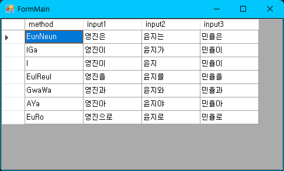

[](https://sonarcloud.io/summary/new_code?id=na1307_Bluehill.Hangul)
[](https://sonarcloud.io/summary/new_code?id=na1307_Bluehill.Hangul)

[](https://github.com/na1307/Bluehill.Hangul/issues)
[](https://github.com/na1307/Bluehill.Hangul/pulls)
[](https://www.nuget.org/packages/Bluehill.Hangul)
[](https://www.nuget.org/packages/Bluehill.Hangul)
[](https://www.nuget.org/packages/Bluehill.Hangul)

여러가지 한글 관련 기능들을 제공합니다.

## 사용
<code>Bluehill.Hangul</code> 네임스페이스를 가져와 사용할 수 있습니다.

```csharp
using Bluehill.Hangul;
```
<code>global using</code>을 사용하면 각 파일에 추가할 필요 없이 프로젝트의 모든 파일에서 사용할 수 있습니다.

```csharp
global using Bluehill.Hangul;
```

만약 특정 기능만 필요하다면 <code>using static</code>을 사용할 수도 있습니다.

```csharp
using static Bluehill.Hangul.Josa;
```

## 한글 조사 처리
을/를, 이/가 등의 한글 조사 처리를 확장 메서드로 간단하게 할 수 있습니다.



다음의 9가지 메서드를 제공합니다.

1. EunNeun (은/는)
1. IGa (이/가)
1. I (이)
1. EulReul (을/를)
1. GwaWa (과/와)
1. AYa (아/야)
1. EuRo (로/으로)
1. Jongseong / NoJongseongOrRieul (커스텀 메서드)

### 기본 메서드
입력받는 매개변수가 없습니다.

```csharp
using Bluehill.Hangul;

Console.WriteLine("성재".EunNeun() + " 내 친구이다."); // 성재는 내 친구이다.
Console.WriteLine("아버지".IGa() + " 방에 들어가신다."); // 아버지가 방에 들어가신다.
Console.WriteLine("소윤".I() + "네집 떡볶이"); // 소윤이네집 떡볶이
```

### defaultJosa 와 josaOnly 매개변수
defaultJosa는 마지막 글자가 한글 글자가 아닐 경우 (영문, 숫자, 한자, 한글 자모 등) 붙는 문자열이고 josaOnly를 <code>true</code>로 설정하면 조사만 반환합니다.

```csharp
using Bluehill.Hangul;

Console.WriteLine("na1307".EunNeun("은") + " 바보다."); // na1307은 바보다.
Console.WriteLine("百聞".I("(이/가)") + " 불여일견"); // 百聞(이/가) 불여일견
Console.WriteLine("사과".EulReul("을(를)", true) + " 깎는다."); // 를 깎는다.
```

### 커스텀 메서드
Jongseong과 NoJongseongOrRieul은 커스텀 메서드입니다. 모든 매개변수를 제공해야 하며, <code>null</code> 값은 허용되지 않습니다.

```csharp
Console.WriteLine("당신".Jongseong("은 누굽니까", "은 저희와 함께 하실 수 없습니다.", "는 저희와 함께 하실 수 있습니다.", false)); // 당신은 저희와 함께 하실 수 없습니다.
Console.WriteLine("무슨 소릴".NoJongseongOrRieul("", "", "를", false) + "하는 거야 지금"); // 무슨 소릴하는 거야 지금
Console.WriteLine("넌".Jongseong("내꺼야", "내꺼야", "저리가", true)); // 내꺼야
```

사실 일반적인 경우라면 쓸 일이 없을 것 같습니다.

## 문자 처리
한글 문자에서 초성 / 중성 / 종성 열거형을 얻고, 열거형을 한글 낱자로 변환할 수 있습니다.

```csharp
const char gal = '갈';
Console.WriteLine(gal.Choseong()); // Giyeok
Console.WriteLine(gal.Jungseong()); // A
Console.WriteLine(gal.Jongseong()); // Rieul
Console.WriteLine(gal.Choseong().ToChar()); // ㄱ
```

## Changelog
[Changelog](CHANGELOG.md)
